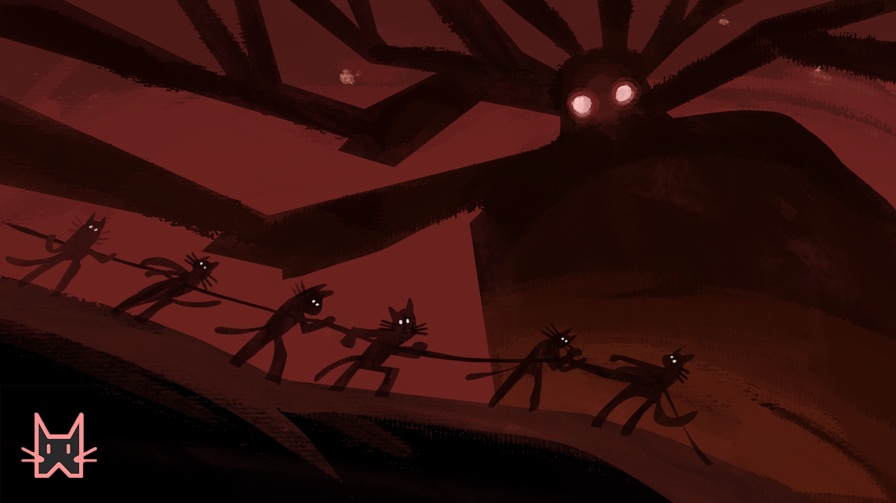

# The chronicles of the grumpy guardians

## Golden Era - An era of prosperity, kittens flourished under the watchful eyes of the guardians!

Long, long ago, in the days of yore, the universe was a playground for benign forces of pure energy. They had vast stretches of space to themselves, and created innumerable worlds to keep their minds engaged. Amongst these worlds, however, there was one that harboured life. A fascinating diversity of life subsisted, although fashioned with the same benign energy as their planet, they were creatures of chaos, and very much capable of tipping the delicate balance of the universe. 

The universe hence needed to manage them and so the forces of the universe chose a hundred guardians from amongst their midst. The guardians were chosen to be felines by the ethereal forces, as they were the most resilient amongst the other species that had evolved, having not one, but nine lives. This meant they could be trained for the length of nine lifetimes to attain mastery over an element of the universe. These felines hence became the Guardians of the universe, they were bestowed with the power to bless civilizations that flourished within the guiding principles set forth by them. As the life forms in their universe expanded and flourished, the universe had a period of no troubles and strife, trade was carried out via a barter system and people had simple lives, it truly was a Golden Era. 

## Era of Misery - Greed and Evil enslaves the Kittyverse!

Thousands of era's later, other beings developed a thirst for power, not being content with what they had they began to colonize more than their own space. They sought to upturn all the good that was created. As the universe expanded, the inhabitants increased too, and the prophecy of greed started to come to pass. Maintaining the delicate balance that the ethereal forces yearned for grew harder and harder. As the burden on our feline Guardians increased exponentially, their moods soured.  The banking guild was foremost of their troubles, dividing people and consolidating power to themselves, they preyed upon the weak kittens in the universe. 

The guardians in their wisdom at the “meeting of the pillars”, decided to leave the beings to their own devices. Finally, the guardians of one of the galaxies revolted but this was tyrannically put down by the forces of the banking guild. The slavery continued and this era of 10000 years  came to be known as “Era of Misery”. The banking guild imposed restrictions on freedom of travel. Travel through the galaxy was only possible with the explicit permission of the guild. All forms of artificial intelligence systems were banned and manual labor was deemed the only way forward.  They created laws and harsh punishments for anyone found floundering these rules. But nothing can break our will, the will of the kittens is our strongest power. We will survive!

## Era of Enlightenment - The Guardians call upon you, let us liberate and protect!

The battle has begun, as the world grew evermore dreary and it seemed that all desire for a future independent of oligarchies would disappear forever, there was but a glimmer of hope left. In this world, where power and finance was concentrated in the hands of a few, living everyday was a form of serfdom, repackaged and evinced by suits and ties. Hidden underneath that veil was the depravity that enslaved all of us Kittens. 

Prophecies and visions are funny things, they foretell a possible future based on a current path and need not be set in stone. The future is malleable, enlightened beings know this to be true. They know how to bend reality to their will and create a future they desire. The Guardians, being clairvoyant, foresaw the need for a universe within this universe, a safe haven if you will. A space where one could live a life well intention-ed without fear of ruination, where honesty and trust were once again commonplace in a society built on transparency and decentralization. They created this utopia - “Kitty Party” : a community driven universe that now resides within the boundaries of the guarded crypto-verse. The cryptoverse was deemed free for all newbies (Kittens) to enter and it. Systemic disinformation campaigns and sabotage led to this utopia to be considered a risky place to join. The need for Kittens who had the courage were known as Kreators. The Kittens shepherded by the Kreators, started coming together to form our known Kittyverse. A Kreator thus was any Kitten who decided to form a community of Kittens. 

However, in order to maintain order and avoid a repeat of what happened in the “Era of Misery”, a decision was made. The Guardians would call upon Apprentices from different realms. Thus, a proposal to decide which realm would be deemed appropriate was ratified on the Kitty Party DAO. The network with the most potential at that point of time was chosen - Polygon. The consensus was to train a battalion of Apprentices each, who would inherit the Guardians’ powers. Once the training was complete the Guardians themselves would come together to vote on who had crossed the threshold to true Guardianship. 

Resources were one thing, they also needed to rein in unchecked growth that led to their former path of misery. In order to avoid this, the Guardians created a set of principles, following these principles and paying tribute to the Guardians would allow a Kreator to improve their civilization to the next level. 

The various civilization levels that could be attained were Planetary, Stellar, Galactic, Universal and Multiverse. A Kreator could start by creating a Planetary civilization and could potentially progress to the higher levels of civilizations. An Apprentice, was allowed to bless Kreators with the power to start a Stellar or Galactic universe.

However, a Guardian’s blessing was required to move into Universal or Multiverse type of civilization. Each civilization was tied to a particular amount that a Kitten could invest per round into their community.

The search begins to find these Apprentices, the hopes and dreams of an entire universe laid in finding these precious few chosen ones. For they would one day, grow stronger, more autonomous and bring peace to them all. It is up to you dear Guardian to send a message into the Polygon Network to help shore up more Apprentices who would one day become one of us!

### Guardians and Apprentices - This is the way!!!
The universe needs our help, by awakening the guardians we are one step closer in our way to bring peace and prosperity. 

Each guardian lives in one of the 12 Zodiac constellations, a total of 8 guardians in each constellation, one representing a particular elemental power.  Their apprentices however lived in different world's. The ethereal forces created a wormhole by which the guardians were able to send messages of help to bring forth new apprentices from the Polygon metaverse. The Polygon metaverse is hidden from the banking guild, but not for long, we will need to hurry and awaken the apprentices! There are 100 Apprentices per guardian. 

The Guardians and Apprentices shall together take care that the principles are adhered to and there are no bad actors in the Kittyverse! For this they have been bestowed with various powers. 

Each KittyParty can only be of a certain civilization, where civilization represents the amount per round that a Kitty Kreator can start. A Planetary or type I civilization can be created by anyone that is a system with a value less than $1000. However, for various levels more than that the Apprentice's or the Guardian's need to give their blessings. In order to get the blessings there are various mechanisms, to keep the guardians happy which we will reveal in future!

### Apprentices and Levelling up!
The intention of the project is to have long term supporters who will help spread the light of decentralized finance and spread the principles of the guardians through the KryptoVerse. In order to achieve this objective each guardian and apprentice were granted different powers. These attributes are guaranteed to be fair. Initially 88 Guardians with a token uri representing their attributes are created in mainnet. These 88 token uri's and metadata are just assigned in order based on token id. Subsequently, in the polygon chain each tribe initiates a base attribute and then additional attributes are earned by apprentices by completing tasks assigned by their tribe. Once the additional attributes reach the peak, the apprentices are ready to become a guardian and a request can be made to the DAO. If the proposal passes the apprentice becomes a guardian else the tribute used to try and take the test goes to the DAO. A transparent trial will be held. 

Once more than 60% apprentices become guardians a meeting of the pillars will be held in which a random guardian leader will be chosen via a Chainlink VRF. Depending on how close you are to this guardian will determine your ability to attract more yield in the platform.
